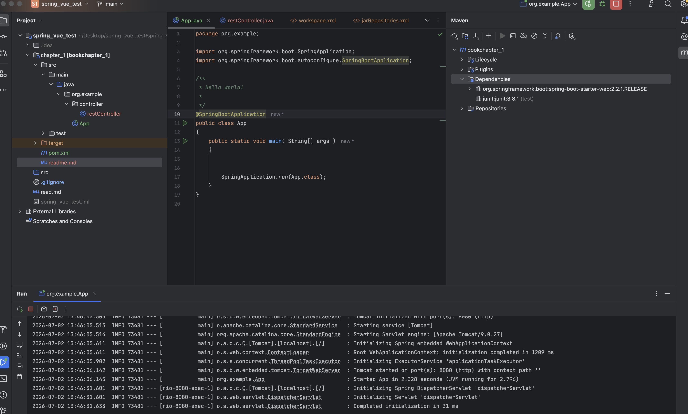
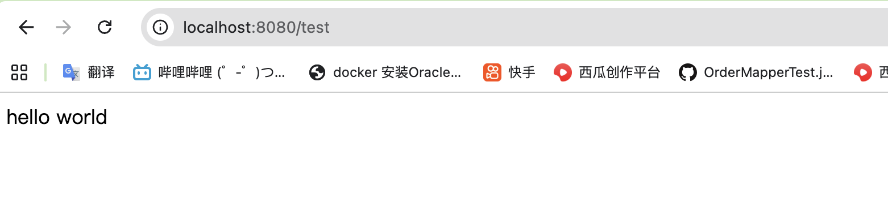

### 如何运行一个第一个springboot helloworld项目

#### 1.添加依赖

parent 依赖提供：maven的默认配置和dependency-management;
dependency-management可以使在引入其他依赖时不用输入版本号
```txt

<parent>
   <groupId>org.springframework.boot</groupId>
    <artifactId>spring-boot-starter-parent</artifactId>
    <version>2.2.1.RELEASE</version>
  </parent>

```
在<dependencies> 下引入其他依赖
```

    <dependency>
      <groupId>org.springframework.boot</groupId>
      <artifactId>spring-boot-starter-web</artifactId>
    </dependency>
    <dependency>
```
#### 2.创建启动类别
@SpringBootApplication 等于@EnableAutoConfiguration+@ComponentScan
```
@SpringBootApplication
public class App 
{
    public static void main( String[] args )
    {


        SpringApplication.run(App.class);
    }
}

```

#### 3.创建rest 接口
@RestController 标记在类上，@GetMapping 或@PostMapping标记在方法上，
```
@RestController
public class restController {
    @GetMapping("/test")
    public String test(){
        return "hello world";
    }
}

```


#### 4.运行结果截图

