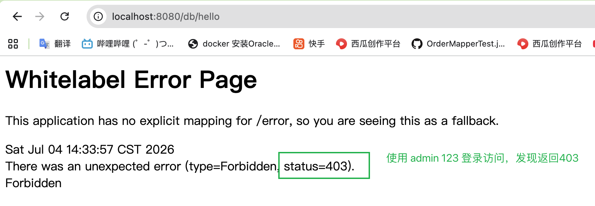
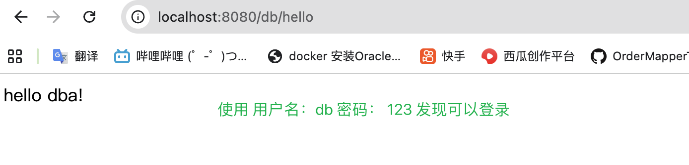
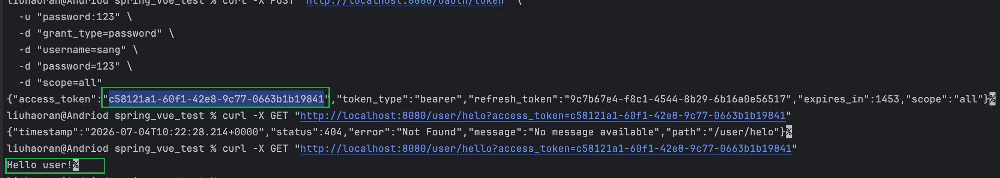
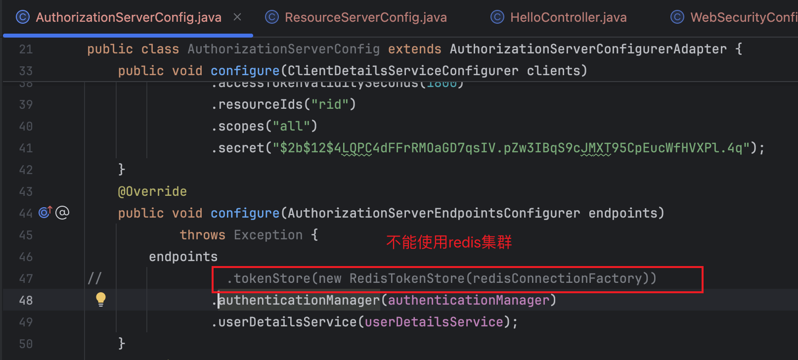
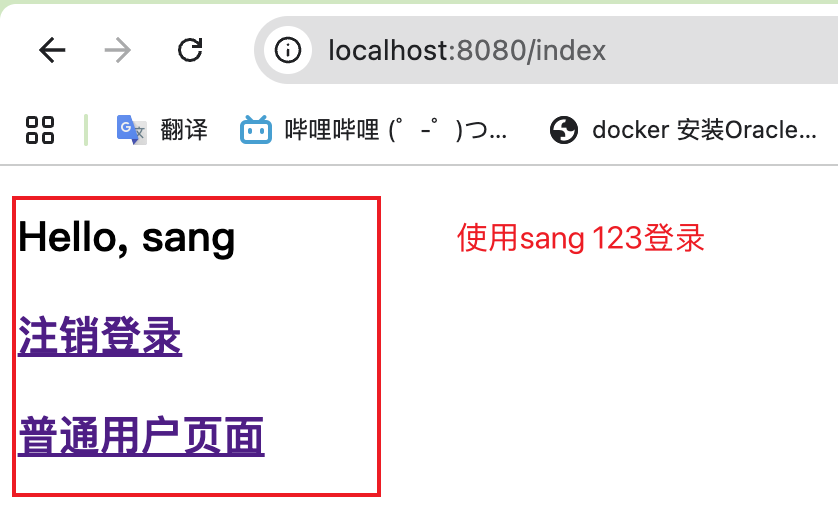
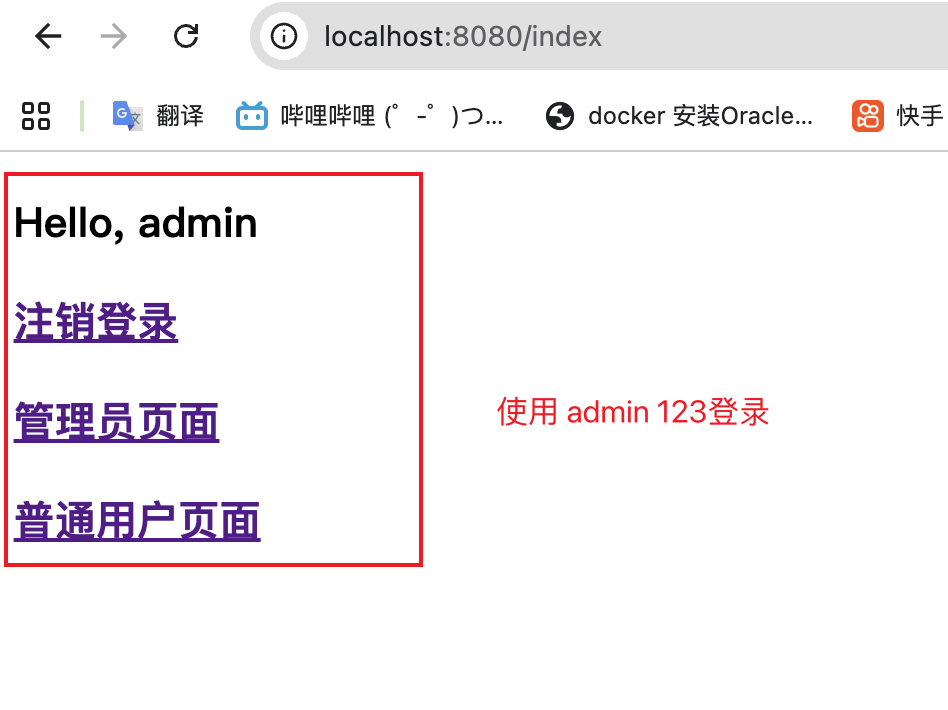

### 一，SpringSecurity 认证授权
#### 1.创建3张表
```sql
-- 用户表
CREATE TABLE `user` (
    `id` INT(11) NOT NULL AUTO_INCREMENT COMMENT '用户ID',
    `username` VARCHAR(32) NOT NULL COMMENT '用户名',
    `password` VARCHAR(255) NOT NULL COMMENT '密码',
    `enabled` TINYINT(1) DEFAULT 1 COMMENT '是否启用(1启用,0禁用)',
    `locked` TINYINT(1) DEFAULT 0 COMMENT '是否锁定(1锁定,0未锁定)',
    PRIMARY KEY (`id`),
    UNIQUE KEY `uk_username` (`username`)
) ENGINE=InnoDB DEFAULT CHARSET=utf8mb4 COMMENT='用户表';

-- 角色表
CREATE TABLE `role` (
    `id` INT(11) NOT NULL AUTO_INCREMENT COMMENT '角色ID',
    `name` VARCHAR(32) NOT NULL COMMENT '角色英文名',
    `nameZh` VARCHAR(32) DEFAULT NULL COMMENT '角色中文名',
    PRIMARY KEY (`id`),
    UNIQUE KEY `uk_name` (`name`)
) ENGINE=InnoDB DEFAULT CHARSET=utf8mb4 COMMENT='角色表';

-- 用户角色关联表（无外键）
CREATE TABLE `user_role` (
    `id` INT(11) NOT NULL AUTO_INCREMENT COMMENT '关联ID',
    `uid` INT(11) NOT NULL COMMENT '用户ID',
    `rid` INT(11) NOT NULL COMMENT '角色ID',
    PRIMARY KEY (`id`),
    UNIQUE KEY `uk_uid_rid` (`uid`, `rid`),
    KEY `idx_rid` (`rid`)
) ENGINE=InnoDB DEFAULT CHARSET=utf8mb4 COMMENT='用户角色关联表';

INSERT INTO `user` (`id`, `username`, `password`, `enabled`, `locked`) VALUES
(1, 'admin', '$2b$12$4LQPC4dFFrRMOaGD7qsIV.pZw3IBqS9cJMXT95CpEucWfHVXPl.4q', 1, 0),
(2, 'user', '$2b$12$4LQPC4dFFrRMOaGD7qsIV.pZw3IBqS9cJMXT95CpEucWfHVXPl.4q', 1, 0),
(3, 'test', '$2b$12$4LQPC4dFFrRMOaGD7qsIV.pZw3IBqS9cJMXT95CpEucWfHVXPl.4q', 1, 0),
(4, 'db', '$2b$12$4LQPC4dFFrRMOaGD7qsIV.pZw3IBqS9cJMXT95CpEucWfHVXPl.4q', 1, 0);

INSERT INTO `role` (`id`, `name`, `nameZh`) VALUES
(1, 'ROLE_admin', '系统管理员'),
(2, 'ROLE_user', '普通用户'),
(3, 'ROLE_test', '测试用户'),
(4, 'ROLE_dba', 'dba用户');

INSERT INTO `user_role` (`id`, `uid`, `rid`) VALUES
(1, 1, 1),
(2, 1, 2),
(3, 2, 2),
(4, 3, 3),
(5, 4, 4)
;
```
#### 2.集成spring security,代码在spring-security-databases模块
当使用 用户名 admin 密码 123 登录访问localhost:8080/dba/hello时，没权限

当使用用户名 db 密码 123 登录访问localhost:8080/dba/hello 时，发现能够访问



### 二，oauth2认证授权
```
curl -X POST "http://localhost:8080/oauth/token" \             
  -u "password:123" \                          
  -d "grant_type=password" \      
  -d "username=sang" \                                                                               
  -d "password=123" \
  -d "scope=all"
```
```
http://localhost:8080/user/hello?access_token=c58121a1-60f1-42e8-9c77-0663b1b19841
```
使用token访问



遇到问题,oauth2 不能接入redis-cluster，有冲突
Spring Security OAuth2 的 RedisTokenStore 在设计上和 Redis Cluster 的分片机制冲突导致的


### 三，shiro 认证授权

admin用户

