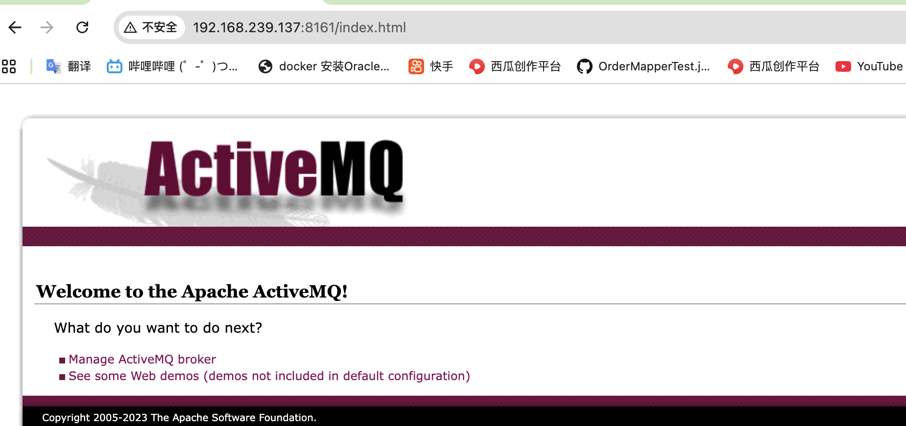
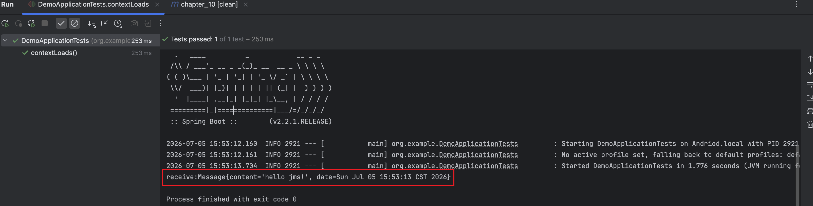
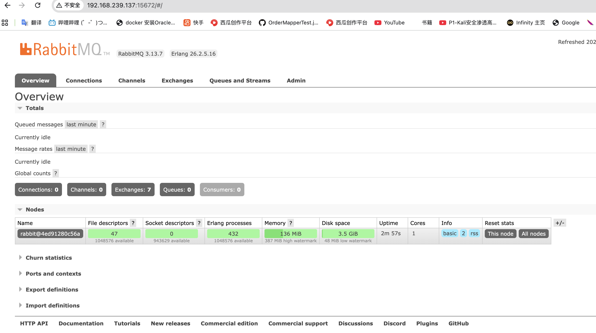
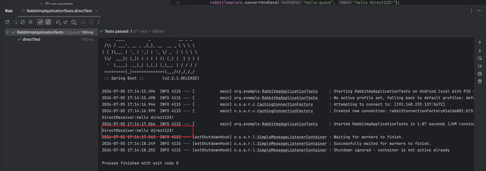
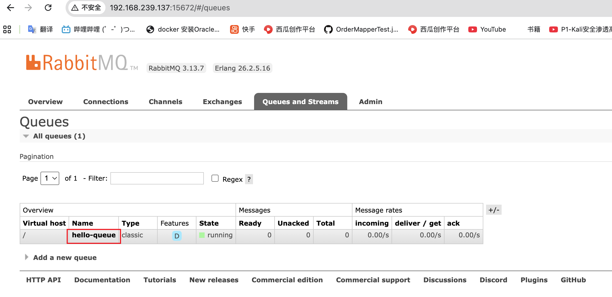
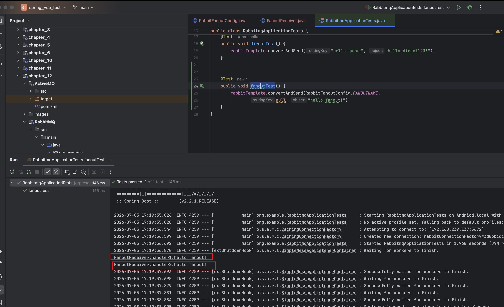
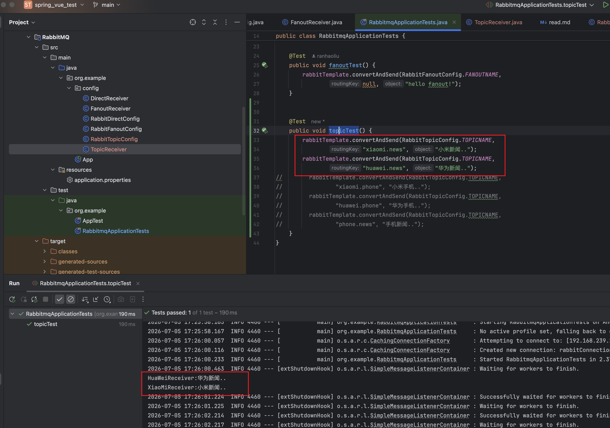
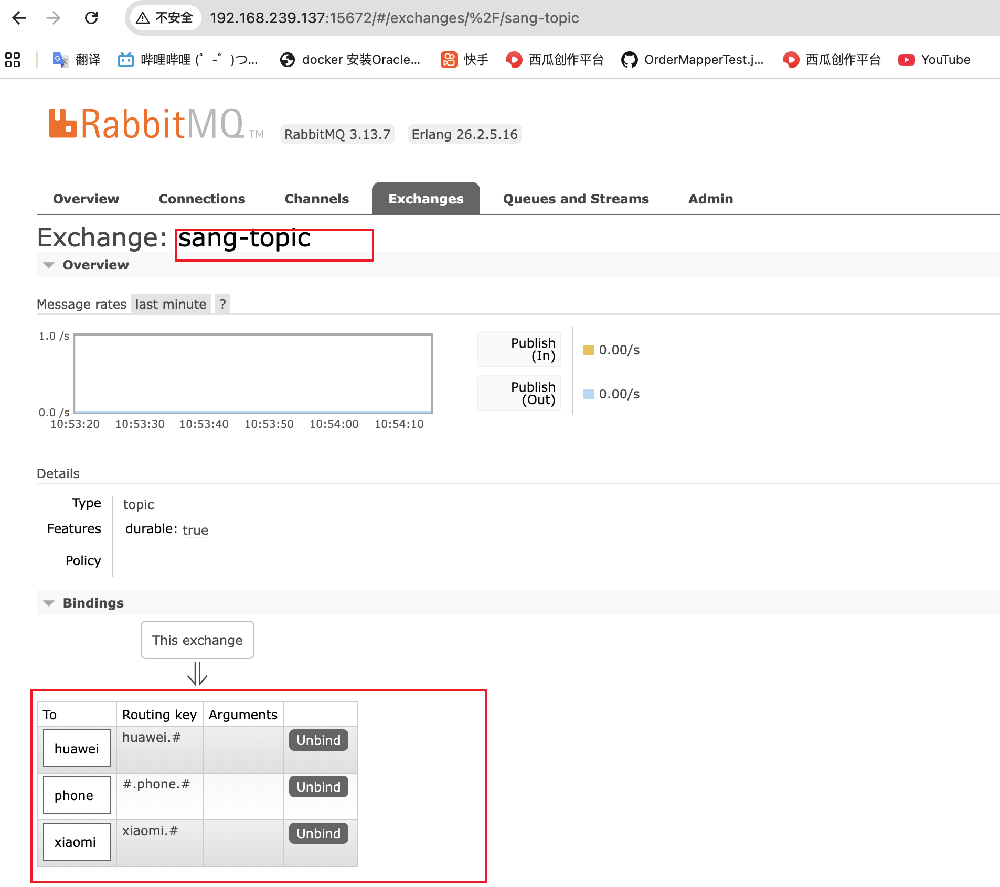

### 一，active mq
1. active mq 的安装
```
docker run -d \
  --name activemq \
  -p 61616:61616 \
  -p 8161:8161 \
  -v activemq-data:/opt/apache-activemq/data \
  -v activemq-conf:/opt/apache-activemq/conf \
  apache/activemq-classic:latest
```
http://192.168.239.137:8161/
默认用户名密码都是 admin


 运行chapter_12/ActiveMQ/src/test/java/org/example/DemoApplicationTests.java下的方法contextLoads


### 二，rabbitmq 
安装
```bazaar
docker run -d \
  --name rabbitmq \
  -p 5672:5672 \
  -p 15672:15672 \
  -e RABBITMQ_DEFAULT_USER=admin \
  -e RABBITMQ_DEFAULT_PASS=admin123 \
  -v rabbitmq_data:/var/lib/rabbitmq \
  rabbitmq:3-management
```
访问：http://192.168.239.137:15672
用户名： admin 密码: admin123
`     
#### 1.Direct（直连）模式
    rabbitTemplate.convertAndSend("hello-queue", "hello direct!");
    直接发送到指定队列名 hello-queue
    不需要指定交换机（使用默认的直连交换机 ""）
    路由键就是队列名本身
    特点：一对一，点对点发送
#### 2.Fanout（广播）模式
    rabbitTemplate.convertAndSend(RabbitFanoutConfig.FANOUTNAME, null, "hello fanout!");
    convertAndSend(exchange, routingKey, message)
    第一个参数是交换机名（如 RabbitFanoutConfig.FANOUTNAME）
    第二个参数 routingKey 为 null（广播模式忽略路由键）
    特点：一对多，发送到该交换机的所有绑定队列都会收到消息
#### 3.Topic（主题）模式
    rabbitTemplate.convertAndSend(RabbitTopicConfig.TOPICNAME, "xiaomi.news", "小米新闻..");
    rabbitTemplate.convertAndSend(RabbitTopicConfig.TOPICNAME, "huawei.news", "华为新闻..");
    rabbitTemplate.convertAndSend(RabbitTopicConfig.TOPICNAME, "xiaomi.phone", "小米手机..");
    
    convertAndSend(exchange, routingKey, message)
    第一个参数：交换机名（Topic 类型交换机）
    第二个参数：路由键（支持通配符匹配）
    特点：支持模糊匹配，灵活路由

    路由键规则：
    . 分隔单词
    * 匹配一个单词
    # 匹配零个或多个单词

    xiaomi.# → 匹配 xiaomi.news、xiaomi.phone
    *.news → 匹配 xiaomi.news、huawei.news
    #.phone → 匹配 xiaomi.phone、huawei.phone
#### 4.三种模式对比
| 模式     | 交换机类型  | 路由键      | 消费者数量   | 适用场景      |
| ------ | ------ | -------- | ------- | --------- |
| Direct | 默认直连   | 队列名      | 1个      | 点对点任务分发   |
| Fanout | fanout | 忽略(null) | 所有绑定队列  | 广播通知、群发   |
| Topic  | topic  | 支持通配符    | 匹配规则的队列 | 分类订阅、新闻推送 |
    
#### 5.路由键是在交换机上吗？
    不是。路由键是消息自带的属性，不是交换机上的配置。
    简单理解：
    路由键 = 消息的"地址标签"（生产者贴上去的）
    交换机 = 根据这个标签决定把消息扔给哪个队列
    绑定键（Binding Key）= 交换机和队列之间的"匹配规则"
    生产者发消息时：
    rabbitTemplate.convertAndSend("交换机名", "路由键", 消息);
    交换机收到后，拿消息的路由键去跟各队列的绑定键做匹配，匹配上的队列就能收到消息。
    所以路由键是随消息一起来的，交换机只是用它来做判断，并不存储它。

#### 运行结果：
1.direct 模式运行结果



2.广播模式



3.topic 模式

交换机和队列通过 匹配规则绑定
