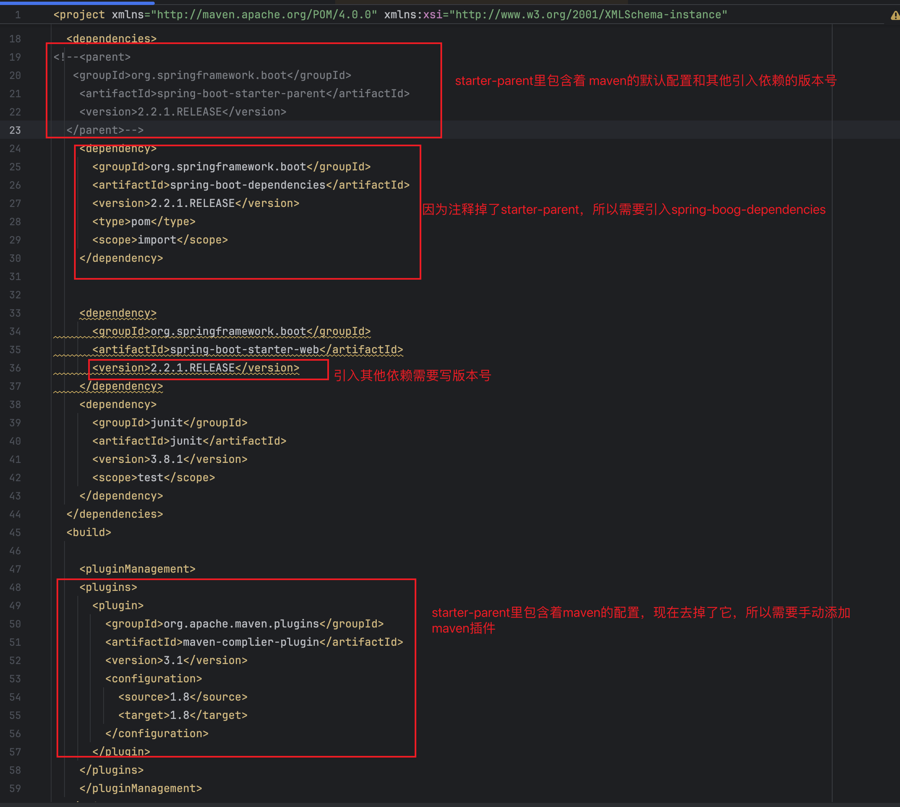
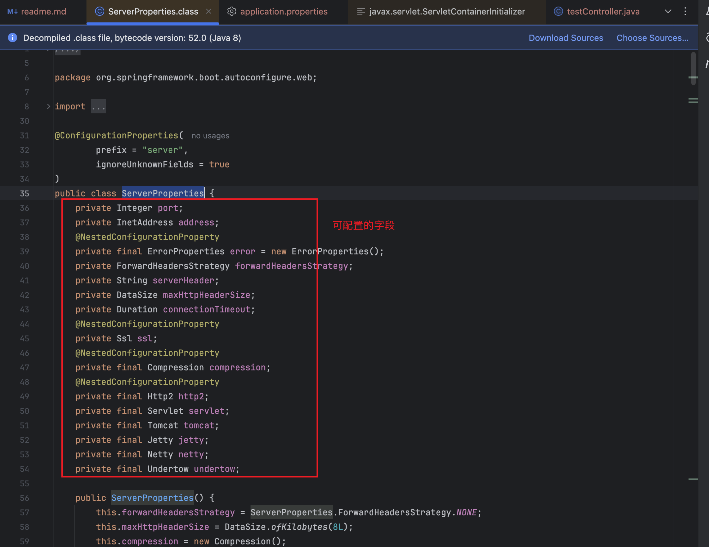
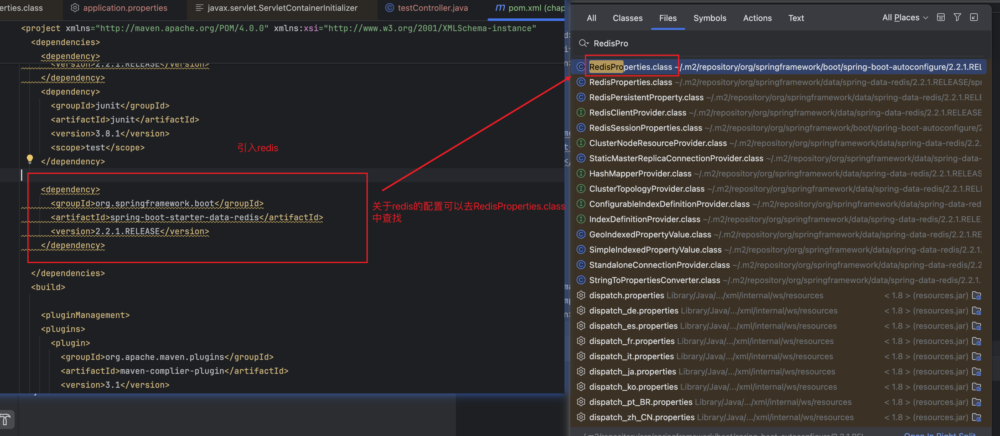
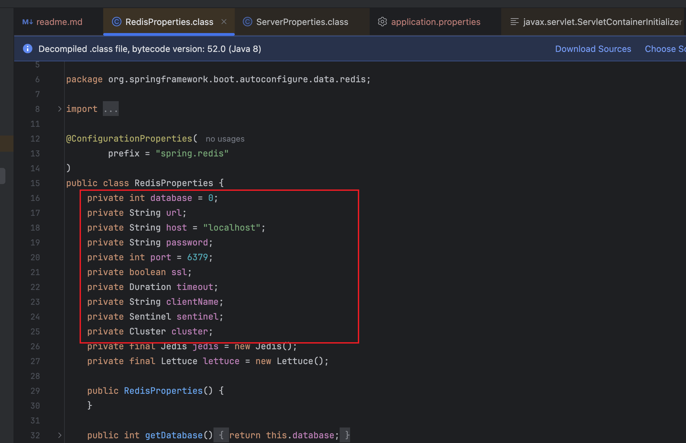
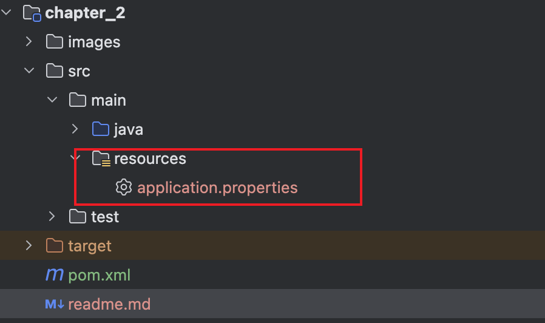
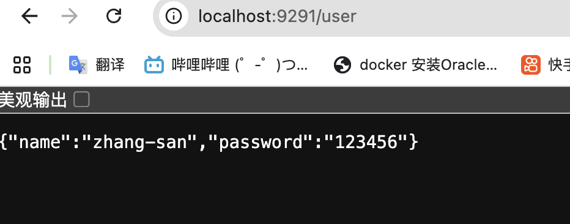
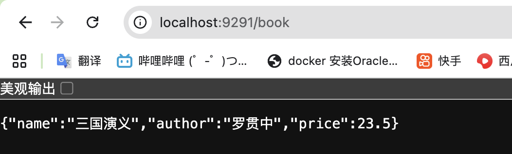

### 1.spring-boot-starter-parent的作用




### 2.配置文件的修改
新引入一个starter，如何查看有哪些内容是可以配置的？
答：使用ctrl + shift +o 搜索 "xxxProperties.class"
例如引入web-starter,starter-data-redis?

ctrl +shift+o 快捷键 进行搜索，
搜ServerProperties.clas 即可看到 web-starter 有哪些可以配置的

例如引入starter-data-redis

可以配置的redis 参数如下:


### 3.配置文件路径

在main目录下新建resources目录，并新建application.properties文件
并配置server.port=9291

重启服务，在浏览器访问


### 4.自定义配置如何引用
1.@value("${自定义的key}")
```bazaar
@Component
public class UserPassword {
    @Value("${username}")
    private String name;
    @Value("${password}")
    private String password;
    }
```

2. @ConfigurationProperties(prefix = "book")
```bazaar

@Component
@ConfigurationProperties(prefix = "book")
public class Book {

    private String name;
    private String author;
    private Float price;
    }
```
