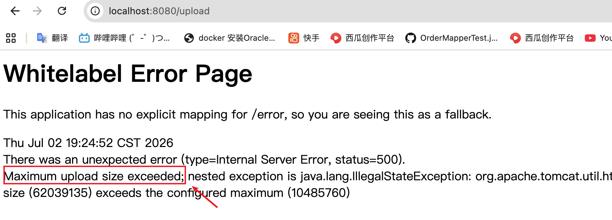
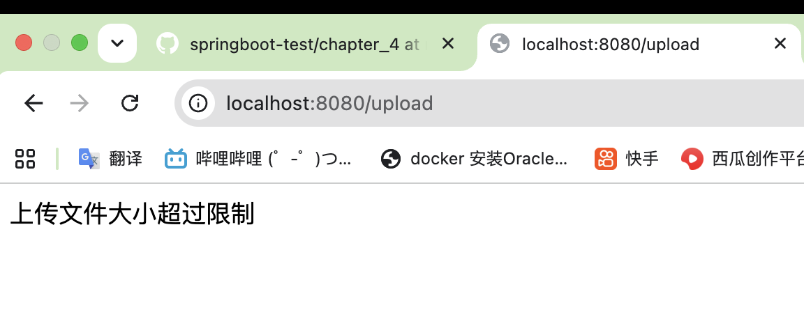
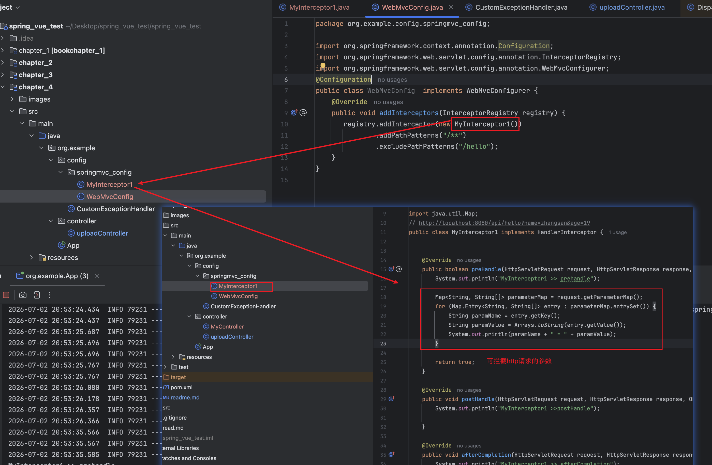
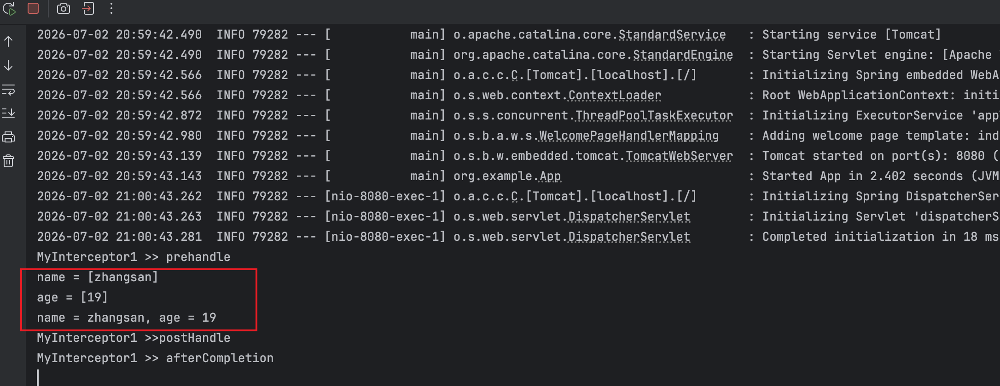

### 一，文件上串 
单文件上传

上传多文件


### 二，全局异常处理

```bazaar
//增加一个全局异常处理类
@ControllerAdvice
public class CustomExceptionHandler {
    @ExceptionHandler(MaxUploadSizeExceededException.class)
    public ModelAndView uploadSizeException(MaxUploadSizeExceededException e) throws IOException {
        ModelAndView mv = new ModelAndView();
        mv.addObject("msg","上传文件大小超过限制");
        mv.setViewName("error");
        return mv;
    }
  //然后再再resources/templates/下新建一个error.html,把值传进去
  //还需要在application.properties中加一行server.tomcat.max-swallow-size=-1 否则 
```


### 三，Spring MVC 注册拦截器
注册拦截器可在HTTP请求处理器拦截参数


访问http://localhost:8080/api/hello?name=zhangsan&age=19



