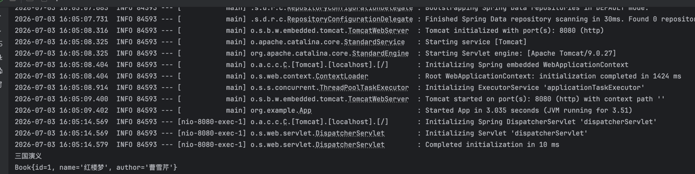
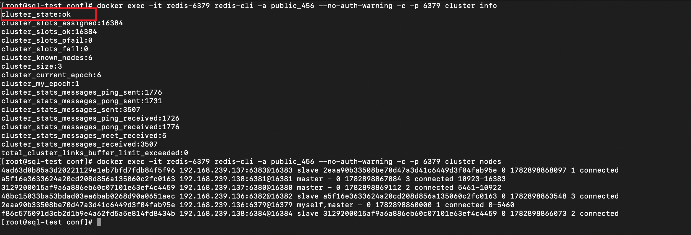
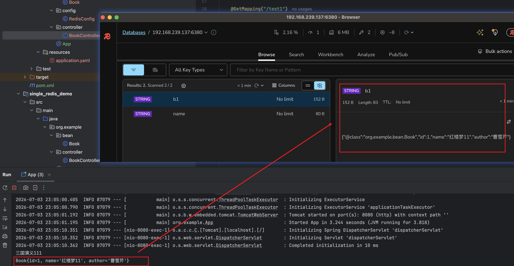

### 一.redis 单节点 安装

docker run -d --name my-redis -p 6379:6379 redis


### 二.redis cluster 集群搭建

| VM  | IP              | 节点                        |
|-----|-----------------|-----------------------------|
| VM1 | 192.168.239.136 | master1 (6379), replica3 (6382) |
| VM2 | 192.168.239.137 | master2 (6380), replica1 (6383) |
| VM3 | 192.168.239.138 | master3 (6381), replica2 (6384) |

#### (1). 在每台机器上准备配置文件 以 VM1 为例，创建两个节点的目录和配置：
vm1:
``` 
mkdir -p /data/redis/6379/{conf,data}
mkdir -p /data/redis/6382/{conf,data}
在/data/redis/6379/conf/redis.conf上写入：
pport 6379
bind 0.0.0.0
protected-mode no
daemonize no
cluster-enabled yes
cluster-config-file nodes.conf
cluster-node-timeout 15000
cluster-announce-ip 192.168.239.136
cluster-announce-port 6379
cluster-announce-bus-port 16379
appendonly yes
dir /data

requirepass public_456
masterauth public_456

在/data/redis/6382/conf/redis.conf上写入
port 6382
bind 0.0.0.0
protected-mode no
daemonize no
cluster-enabled yes
cluster-config-file nodes.conf
cluster-node-timeout 15000
cluster-announce-ip 192.168.239.136
cluster-announce-port 6382
cluster-announce-bus-port 16382
appendonly yes
dir /data
requirepass public_456
masterauth public_456

```
vm2:
```
 mkdir -p /data/redis/6380/{conf,data}
 mkdir -p /data/redis/6383/{conf,data}
 
在/data/redis/6380/conf/redis.conf上写入：
port 6380
bind 0.0.0.0
protected-mode no
daemonize no
cluster-enabled yes
cluster-config-file nodes.conf
cluster-node-timeout 15000
cluster-announce-ip 192.168.239.137
cluster-announce-port 6380
cluster-announce-bus-port 16380
appendonly yes
dir /data

requirepass public_456
masterauth public_456

在/data/redis/6383/conf/redis.conf上写入
port 6383
bind 0.0.0.0
protected-mode no
daemonize no
cluster-enabled yes
cluster-config-file nodes.conf
cluster-node-timeout 15000
cluster-announce-ip 192.168.239.137
cluster-announce-port 6383
cluster-announce-bus-port 16383
appendonly yes
dir /data

requirepass public_456
masterauth public_456
```
vm3:
```
mkdir -p /data/redis/6381/{conf,data}
 mkdir -p /data/redis/6384/{conf,data}
 
 在/data/redis/6381/conf/redis.conf上写入
 port 6381
bind 0.0.0.0
protected-mode no
daemonize no
cluster-enabled yes
cluster-config-file nodes.conf
cluster-node-timeout 15000
cluster-announce-ip 192.168.239.138
cluster-announce-port 6381
cluster-announce-bus-port 16381
appendonly yes
dir /data

requirepass public_456
masterauth public_456

在/data/redis/6384/conf/redis.conf上写入
 port 6384
bind 0.0.0.0
protected-mode no
daemonize no
cluster-enabled yes
cluster-config-file nodes.conf
cluster-node-timeout 15000
cluster-announce-ip 192.168.239.138
cluster-announce-port 6384
cluster-announce-bus-port 16384
appendonly yes
dir /data

requirepass public_456
masterauth public_456
```

#### (2)启动容器
vm1
```
systemctl stop firewalld
docker run -d --name redis-6379 \
  --network host \
  --restart always \
  -v /data/redis/6379/conf/redis.conf:/etc/redis/redis.conf \
  -v /data/redis/6379/data:/data \
  redis:7.2 redis-server /etc/redis/redis.conf

docker run -d --name redis-6382 \
  --network host \
  --restart always \
  -v /data/redis/6382/conf/redis.conf:/etc/redis/redis.conf \
  -v /data/redis/6382/data:/data \
  redis:7.2 redis-server /etc/redis/redis.conf
```
vm2
```
systemctl stop firewalld

docker run -d --name redis-6380 \
  --network host \
  --restart always \
  -v /data/redis/6380/conf/redis.conf:/etc/redis/redis.conf \
  -v /data/redis/6380/data:/data \
  redis:7.2 redis-server /etc/redis/redis.conf

docker run -d --name redis-6383 \
  --network host \
  --restart always \
  -v /data/redis/6383/conf/redis.conf:/etc/redis/redis.conf \
  -v /data/redis/6383/data:/data \
  redis:7.2 redis-server /etc/redis/redis.conf
```
vm3
```
systemctl stop firewalld

docker run -d --name redis-6381 \
  --network host \
  --restart always \
  -v /data/redis/6381/conf/redis.conf:/etc/redis/redis.conf \
  -v /data/redis/6381/data:/data \
  redis:7.2 redis-server /etc/redis/redis.conf

docker run -d --name redis-6384 \
  --network host \
  --restart always \
  -v /data/redis/6384/conf/redis.conf:/etc/redis/redis.conf \
  -v /data/redis/6384/data:/data \
  redis:7.2 redis-server /etc/redis/redis.conf
```
#### (3)创建集群
```
docker exec -it redis-6379 redis-cli -a public_456 --no-auth-warning --cluster create \
  192.168.239.136:6379 \
  192.168.239.137:6380 \
  192.168.239.138:6381 \
  192.168.239.137:6383 \
  192.168.239.138:6384 \
  192.168.239.136:6382 \
  --cluster-replicas 1
```

#### (4)验证
```
docker exec -it redis-6379 redis-cli -a public_456 --no-auth-warning -c -p 6379 cluster info
docker exec -it redis-6379 redis-cli -a public_456 --no-auth-warning -c -p 6379 cluster nodes
```
如果出现cluster_state: ok则表示创建成功


### 三，springboot接入redis cluster集群
接入代码详见 redis_cluster_demo模块
运行执行结果
