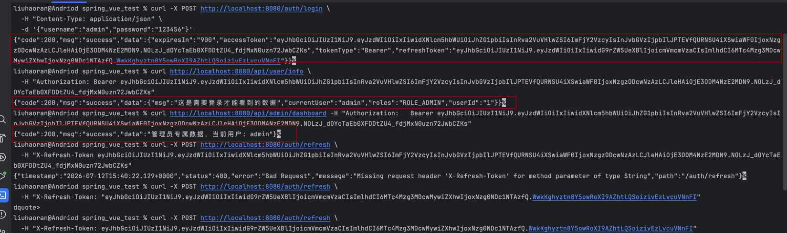
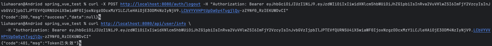

```bazaar
# 1. 登录（admin 拥有 ROLE_ADMIN）
curl -X POST http://localhost:8080/auth/login \
  -H "Content-Type: application/json" \
  -d '{"username":"admin","password":"123456"}'

# 2. 访问普通接口
curl http://localhost:8080/api/user/info \
  -H "Authorization: Bearer <accessToken>"

# 3. 访问管理员接口（admin 能访问，user 会报 403）
curl http://localhost:8080/api/admin/dashboard \
  -H "Authorization: Bearer <accessToken>"

# 4. 刷新 Token
curl -X POST http://localhost:8080/auth/refresh \
  -H "X-Refresh-Token: <refreshToken>"

# 5. 登出
curl -X POST http://localhost:8080/auth/logout \
  -H "Authorization: Bearer <accessToken>"
```
生成token

模仿token失效的效果
